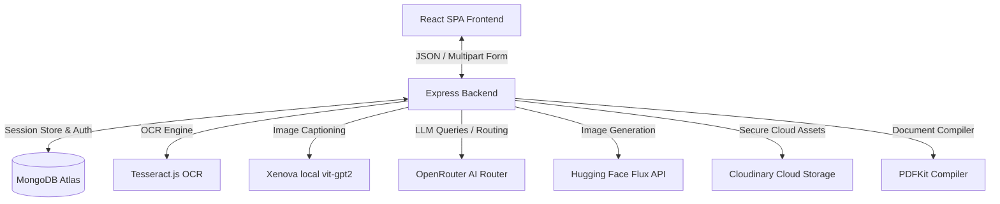

# Dogpt Premium AI Studio: Architecture & Technical Guide

Welcome to the **Dogpt AI Studio** technical documentation and revision manual. This project is a three-column AI workspace that integrates OCR extraction, local image captioning, intelligent text/image routing, Hugging Face generation models, PDF compiling, and secure cloud storage.

---

## 1. System Architecture Overview

The application follows a decoupled client-server architecture:

---

## 2. Theoretical Breakdown of Core Pipelines

### A. The OCR Extraction Pipeline (`Tesseract.js`)
* **Theory:** Optical Character Recognition (OCR) operates by analyzing the pixels of an image, detecting edges, segmenting text into lines, words, and characters, and matching them against a pre-trained language matrix (such as `eng.traineddata`).
* **Implementation:** The backend initiates a worker via `createWorker('eng')`, recognizes text, and immediately terminates the worker with `worker.terminate()` to prevent memory leaks and free up thread locks in Node.js.

### B. The Local Image Captioning Pipeline (`Xenova/Transformers`)
* **Theory:** When an uploaded image contains no readable text, standard OCR fails. We use a Vision-Encoder-Decoder model (`vit-gpt2-image-captioning`). The Vision Encoder processes the image into visual feature tensors, and the GPT-2 Decoder uses autoregressive text generation to describe those features in plain English.
* **Implementation:** Runs locally on the Node server using `@xenova/transformers` (ONNX runtime), eliminating external API costs for image captioning.

### C. OpenRouter Intelligent Routing & Fallbacks
* **Theory:** A single large model can be slow and expensive. We use a **Router-Dispatcher Pattern**. The backend sends the combined context (OCR output, image caption, filename) to an LLM router (`openrouter/auto`) to classify user intent.
* **Fallback Pool:** To safeguard against rate-limiting or service outages, standard chat queries cycle through a fallback list of models (`FREE_MODELS_POOL`):
  1. `openrouter/free` (auto-router)
  2. `meta-llama/llama-3.2-3b-instruct:free`
  3. `nvidia/nemotron-3-nano-30b-a3b:free`
  4. `liquid/lfm-2.5-1.2b-instruct:free`

### D. Hugging Face Flux Image Generation
* **Theory:** Latent Diffusion Models (LDMs) generate images by starting with random Gaussian noise and iteratively denoising the latent representation guided by textual embeddings (CLIP or T5 text encoders). We use `black-forest-labs/FLUX.1-schnell` for low-inference-step generation.
* **Implementation:** Query Hugging Face's serverless inference endpoints with bearer tokens, receive raw binary image buffers, write them temporarily, and upload them to Cloudinary.

### E. Cloudinary Secure Asset Storage & Local Cleanup
* **Theory:** Direct local storage of files in ephemeral hosting environments (like Render) leads to data loss on dyno restarts. Saving assets to a dedicated cloud CDN (Cloudinary) resolves this.
* **Cleanup Mechanism:** Files are written to `/uploads` temporarily, uploaded to Cloudinary, and unlinked from the server disk (`fs.unlink`) on completion. If Cloudinary fails, the app falls back to local URLs as a fail-safe.

### F. PDF Document Compiler (`PDFKit`)
* **Theory:** Documents are compiled dynamically using a write-stream PDF generator. It parses plain text outputs, computes page boundaries and word wraps, writes the compiled buffer to disk, and pushes the PDF raw format to Cloudinary.

---

## 3. Technology Stack

### Frontend (React Studio)
- **Framework:** React 19 + Vite (built for lightning-fast hot module reloading).
- **Styling:** Tailwind CSS v4 (responsive utility classes) + Material-UI v7/v6 (IDE-like system panels and buttons).
- **Routing:** React Router v7 (handles session-to-session navigations).
- **Icons & Markdown:** Lucide React, Material Icons, React Markdown (rehype-highlight for visual code blocks).

### Backend (Express Server)
- **Runtime:** Node.js (ESM Modules, `"type": "module"`).
- **Database & ODM:** MongoDB Atlas + Mongoose.
- **Session Auth:** Express Session, MongoStore (persistent sessions across restarts), Passport + Passport Local Mongoose.
- **Asset Processing:** Multer (multipart form handling), PDFKit, Tesseract.js.

---

## 4. Deployment Guides

### Frontend (Vercel)
Vercel is optimized for static and single-page apps (SPAs). 

1. **History API Fallback Configuration:** Because React Router uses client-side routing, reloading a page like `/chat/1234` will cause a Vercel 404 error. To prevent this, we add a `vercel.json` rewrite rule to redirect all routes to `index.html`.
2. **Environment Variables:** Set `VITE_SERVER_URL=https://your-backend.onrender.com` in Vercel settings.

### Backend (Render)
1. **Service Type:** Web Service.
2. **Build Command:** `npm install`
3. **Start Command:** `npm start` (Runs `node server.js`).
4. **Environment Variables:**
   - `PORT=3000`
   - `MONGO_URI=mongodb+srv://...`
   - `SESSION_SECRET=...`
   - `OPENROUTER_API_KEY=...`
   - `HF_TOKEN=...`
   - `CLOUDINARY_CLOUD_NAME=...`
   - `CLOUDINARY_API_KEY=...`
   - `CLOUDINARY_API_SECRET=...`
   - `CLOUDINARY_UPLOAD_PRESET=...`
